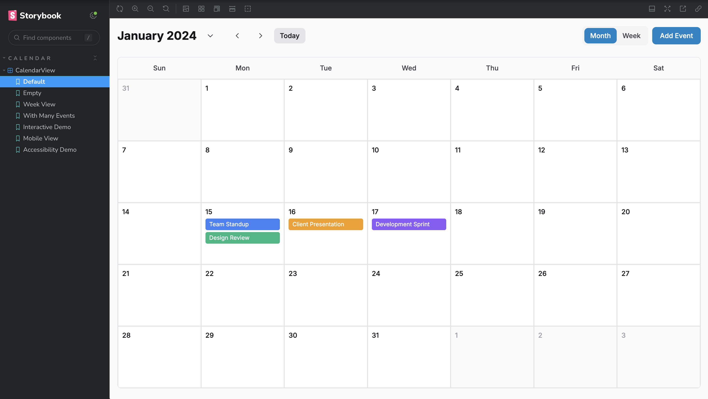
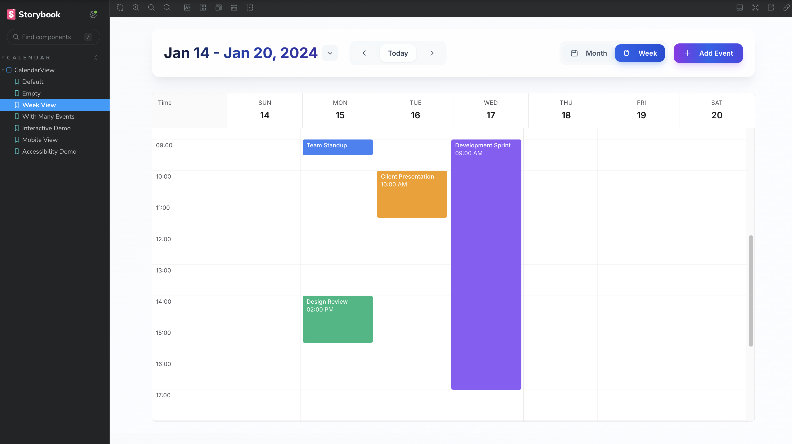
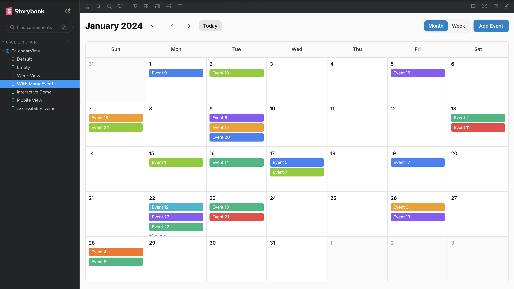

<h1 align="center">📅 Calvista — Interactive React Calendar Component</h1>

<p align="center">
  🚀 A fully interactive, accessible calendar component built with React, TypeScript, and Tailwind CSS. Features month and week views, event management, and comprehensive accessibility support for <b>modern web applications</b> and SaaS platforms.
</p>

<p align="center">
  
  
  
  
  
  
</p>
<br>

---

## 📖 Problem Statement
Modern web applications need robust calendar components that handle complex event management, provide seamless user experience across devices, maintain accessibility standards for all users, and offer flexible integration with existing design systems in today's diverse development ecosystem.

<br>

---

## 💡 Our Solution
Calvista is a production-ready React calendar component built to:

- 📊 Handle 500+ events with optimized performance and efficient rendering
- 🎯 Provide intuitive event management with create, edit, and delete functionality
- 🌍 Support responsive design across mobile, tablet, and desktop devices
- 📈 Deliver WCAG 2.1 AA compliant accessibility with full keyboard navigation
- 💾 Export comprehensive Storybook documentation for easy integration
<br>

---  

## 🚀 Features

✅  **Interactive event management** with modal-based creation and editing interface  
✅  **Month and week views** with seamless switching and navigation controls  
✅  **Responsive design** optimized for mobile, tablet, and desktop experiences  
✅  **Full accessibility support** with ARIA labels and keyboard navigation  
✅  **Performance optimized** for large datasets with React.memo and efficient state management  
✅  **TypeScript strict mode** with comprehensive type safety and IntelliSense support  
✅  **Storybook integration** with interactive documentation and component playground

<br>

---  

## 🛠️ Tech Stack

<div align="center">

<table>
<thead>
<tr>
<th>🖥️ Technology</th>
<th>⚙️ Description</th>
</tr>
</thead>
<tbody>
<tr>
<td></td>
<td>Modern component framework with hooks and context</td>
</tr>
<tr>
<td></td>
<td>Type-safe development with strict mode enabled</td>
</tr>
<tr>
<td></td>
<td>Utility-first CSS framework for rapid styling</td>
</tr>
<tr>
<td></td>
<td>Component documentation and interactive playground</td>
</tr>
<tr>
<td></td>
<td>Fast build tool and development server</td>
</tr>
<tr>
<td></td>
<td>Modern date utility library for manipulation</td>
</tr>
<tr>
<td></td>
<td>Conditional class name utility for dynamic styling</td>
</tr>
</tbody>
</table>

</div>

<br>

---

## 📁 Project Directory Structure

```
Calvista/
├── 📂 .storybook/                  # 📚 Storybook configuration
│   ├── 📄 main.ts                  # 🔧 Main Storybook config
│   └── 📄 preview.ts               # 🎨 Preview configuration
├── 📂 src/                         # 🎯 Source code directory
│   ├── 📂 components/              # 🧩 React components
│   │   ├── 📂 Calendar/            # 📅 Calendar component modules
│   │   │   ├── 📄 CalendarView.tsx # 🏠 Main calendar component
│   │   │   ├── 📄 CalendarCell.tsx # 📋 Individual date cell
│   │   │   ├── 📄 MonthView.tsx    # 📊 Month view layout
│   │   │   ├── 📄 WeekView.tsx     # 📈 Week view layout
│   │   │   ├── 📄 EventModal.tsx   # ✏️ Event creation modal
│   │   │   ├── 📄 MobileListView.tsx # 📱 Mobile-optimized view
│   │   │   ├── 📄 CalendarView.stories.tsx # 📖 Storybook stories
│   │   │   └── 📄 CalendarView.types.ts # 🔤 TypeScript definitions
│   │   └── 📂 primitives/          # 🔧 Reusable UI primitives
│   │       ├── 📄 Button.tsx       # 🔘 Enhanced button component
│   │       ├── 📄 Modal.tsx        # 🪟 Modal component
│   │       └── 📄 Select.tsx       # 📋 Modern select dropdown
│   ├── 📂 hooks/                   # 🎣 Custom React hooks
│   │   ├── 📄 useCalendar.ts       # 📅 Calendar state management
│   │   └── 📄 useEventManager.ts   # 📝 Event management logic
│   ├── 📂 utils/                   # 🛠️ Utility functions
│   │   ├── 📄 date.utils.ts        # 📅 Date manipulation helpers
│   │   └── 📄 event.utils.ts       # 📝 Event processing utilities
│   ├── 📂 styles/                  # 🎨 Global styles
│   │   └── 📄 globals.css          # 🌐 Modern CSS with glass effects
│   └── 📄 main.tsx                 # 🚀 Application entry point
├── 📂 docs/                        # 📸 Updated screenshots
│   ├── 📄 Default_View.png         # 📊 Modern calendar view
│   ├── 📄 Events_View.png          # 📝 Enhanced events interface
│   └── 📄 Week_View.png            # 📅 Professional week layout
├── 📂 storybook-static/            # 📦 Built Storybook documentation
│   ├── 📂 assets/                  # 🎯 Compiled assets
│   ├── 📂 sb-addons/              # 🔌 Storybook addons
│   ├── 📂 sb-manager/             # 📋 Storybook manager
│   └── 📂 sb-preview/             # 👀 Preview components
├── 📄 netlify.toml                 # 🌐 Netlify deployment config
├── 📄 _redirects                   # 🔄 SPA routing rules
├── 📄 .nvmrc                       # 📦 Node.js version (18+)
├── 📄 package.json                 # 📦 Dependencies & scripts
├── 📄 vite.config.ts               # ⚡ Vite build configuration
├── 📄 tailwind.config.js           # 🎨 Tailwind CSS setup
├── 📄 tsconfig.json                # 🔧 TypeScript configuration
├── 📄 postcss.config.js            # 🎨 PostCSS processing
├── 📄 .eslintrc.cjs                # 📏 Code quality rules
├── 📄 index.html                   # 🌐 HTML entry point
└── 📄 README.md                    # 📖 Complete documentation
```
<br>

## 📸 Preview Images

| 📍 Component / Feature       | 📸 Screenshot                                              |
|:----------------------------|:-----------------------------------------------------------|
| Modern Calendar Interface   |                     |
| Professional Week Layout    |                           |
| Enhanced Events Management  |                       |

<br>

---

## 📦 How to Run

### 📌 Prerequisites
- ✅ **Node.js 18+** installed
- ✅ **npm or yarn** package manager
- ✅ **Git** for cloning repository

<br>

---  

### 🚀 Quick Start

1. Clone and install dependencies:

   ```bash
   git clone https://github.com/AbhishekGiri04/CalendarView.git
   cd Calvista
   npm install
   ```

2. Start development servers:

   ```bash
   # Start Storybook (recommended)
   npm run storybook

   # Or start development server
   npm run dev
   ```

3. Access the application:

   ```
   Storybook: http://localhost:6006
   Dev Server: http://localhost:5173
   ```

### 🌐 Live Demo

**🚀 Deployed on Vercel**: [https://calvista.vercel.app](https://calvista.vercel.app)

### 📦 Vercel Deployment

**One-Click Deploy:**

[](https://vercel.com/new/clone?repository-url=https://github.com/AbhishekGiri04/CalendarView)

**Manual Deploy:**
```bash
# Build the project
npm run build

# Deploy dist/ folder to Vercel
# Or connect GitHub repo for auto-deployment
```

### 🔧 Available Scripts

```bash
# Development
npm run dev          # Start Vite development server
npm run storybook    # Start Storybook documentation

# Production
npm run build        # Build for production
npm run build-storybook # Build Storybook static files
npm run preview      # Preview production build

# Code Quality
npm run lint         # Run ESLint checks
```
<br>

---

## 📖 Core Components

* **CalendarView.tsx** — Main orchestrating component with view switching and state management
* **MonthView.tsx** — Month layout with grid-based date display and event rendering
* **WeekView.tsx** — Week layout with time-based scheduling and hourly slots
* **CalendarCell.tsx** — Individual date cell with event display and interaction handling
* **EventModal.tsx** — Modal interface for creating, editing, and deleting events
* **useCalendar.ts** — Custom hook for calendar navigation and date state management
* **useEventManager.ts** — Custom hook for event CRUD operations and state management
* **date.utils.ts** — Date manipulation utilities using date-fns library

<br>

---

## 🎨 Storybook Stories

```bash
# Available Stories
Default              # Current month with sample events
Empty State          # Clean calendar with no events
Week View            # Time-based weekly layout
Many Events          # Performance test with 25+ events
Interactive Demo     # Fully functional event management
Mobile View          # Responsive mobile layout
Accessibility Demo   # Keyboard navigation showcase
```
<br>

---

## 🧪 Component Usage

```tsx
import { CalendarView } from './components/Calendar/CalendarView';

function App() {
  return (
    <div className="p-4">
      <CalendarView
        initialView="month"
        events={[
          {
            id: '1',
            title: 'Team Meeting',
            date: new Date(),
            startTime: '10:00',
            endTime: '11:00'
          }
        ]}
        onEventCreate={(event) => console.log('Created:', event)}
        onEventUpdate={(event) => console.log('Updated:', event)}
        onEventDelete={(id) => console.log('Deleted:', id)}
      />
    </div>
  );
}
```

## ⚠️ Common Issues

**Storybook not starting:**
```bash
rm -rf node_modules
npm install
npm run storybook
```

**TypeScript errors:**
```bash
npm run lint
# Fix any ESLint issues
```

**Build failures:**
```bash
npm run build
# Check for any compilation errors
```
<br>

---

## 📊 Performance Metrics

- **500+ Events** — Optimized rendering with React.memo and efficient state management
- **<100ms Render** — Fast component updates with optimized re-rendering strategies
- **WCAG 2.1 AA** — Full accessibility compliance with keyboard navigation support
- **Mobile First** — Responsive design tested across all device breakpoints
- **TypeScript Strict** — 100% type coverage with comprehensive type definitions
- **Modern UI/UX** — Glass morphism effects with professional design system
- **Vercel Ready** — Optimized for instant deployment with edge network
- **<2MB Bundle** — Minimal bundle size with tree-shaking and code splitting

<br>

---

## 🌱 Future Scope
- 📱 **Drag & Drop** — Event dragging and resizing functionality

- 🌍 **Timezone Support** — Multi-timezone event handling and display

- 📊 **Recurring Events** — Support for daily, weekly, monthly recurring events

- 🔐 **Event Categories** — Color-coded event categories and filtering

- 🚀 **Export Features** — iCal, Google Calendar integration and export

- 🎬 **Animation Library** — Smooth transitions and micro-interactions

  <br>

  ---  

## 📞 Help & Contact  

> 💬 *Got questions or need assistance with Calvista Component?*  
> We're here to help with integration and customization!

<div align="center">

<b>👤 Abhishek Giri</b>  
<a href="https://www.linkedin.com/in/abhishek-giri04/">
  
</a>  
<a href="https://github.com/abhishekgiri04">
  
</a>  
<a href="https://t.me/AbhishekGiri7">
  
</a>

<br/>

---

**📅 Built with ❤️ for Modern Web Development**  
*Empowering Developers with Accessible Calendar Solutions*

</div>

---

<div align="center">

**© 2025 Calvista - Interactive React Calendar Component. All Rights Reserved.**

</div>